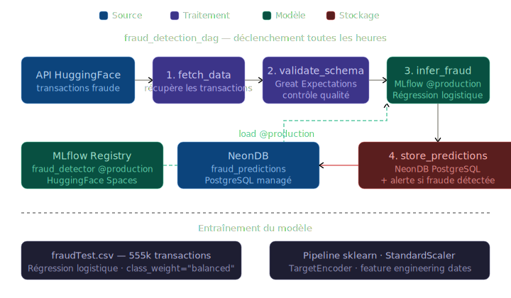

# Automatic Fraud Detection

Projet réalisé dans le cadre du bloc 3 de la certification AIA (Jedha).

---

## Contexte

Une banque veut détecter les transactions frauduleuses en temps réel et recevoir une alerte dès qu'une fraude est identifiée. Elle a aussi besoin d'un bilan quotidien de toutes les transactions de la veille.

---

## Ce que j'ai fait

**Entraînement du modèle**

Régression logistique avec `class_weight="balanced"` sur le dataset `fraudTest.csv` (~555k transactions, 0.38% de fraudes). Le preprocessing est encapsulé dans un pipeline sklearn : feature engineering sur les dates, StandardScaler pour les variables numériques, TargetEncoder pour les catégorielles.

Le modèle est enregistré dans MLflow avec l'alias `@production`.

**Pipeline de serving — DAG Airflow**

Un DAG se déclenche toutes les heures et enchaîne 5 tâches. Le tout tourne dans Docker avec LocalExecutor.

**Notification Slack**

Dès qu'une fraude est détectée, une alerte est envoyée automatiquement dans un channel Slack dédié (`#fraud-alerts`) via webhook entrant. Le message indique le nombre de fraudes détectées, le volume total de transactions analysées et l'heure UTC de l'analyse.



### Demo DAG

[Voir la démo du DAG en action](DAG_demo.mov)

---

## Stack

- Python — scikit-learn, pandas, MLflow
- Apache Airflow 2.10 (Docker)
- Great Expectations 1.3
- MLflow Model Registry (HuggingFace Space)
- NeonDB (PostgreSQL managé)
- AWS S3 (stockage des artefacts MLflow)
- Slack (notifications webhook)

---

## Structure

```
Bloc-3/
├── docs/
│   ├── automatic-fraud-detection.md   # Énoncé du projet
│   └── fraud_detection_pipeline.svg   # Schéma du pipeline
├── training/
│   ├── train_model.py                 # Entraînement + enregistrement MLflow
│   └── fraud_detector.joblib          # Modèle entraîné (export local)
├── airflow/
│   ├── dags/
│   │   └── fraud_detection_dag.py     # DAG Airflow (5 tâches)
│   ├── Dockerfile
│   ├── docker-compose.yml
│   ├── requirements.txt
│   └── LANCER_AIRFLOW.md              # Guide de démarrage rapide
├── Fraud_detection_logo.png
└── README.md
```

---

## Lancer le DAG

Voir [airflow/LANCER_AIRFLOW.md](airflow/LANCER_AIRFLOW.md) pour le détail complet. En résumé :

```bash
# Depuis le dossier airflow/
docker compose up -d
# Interface : http://localhost:8080  (admin / admin)
# Activer le DAG fraud_detection_pipeline puis cliquer sur ▶
```

Le DAG se déclenche ensuite automatiquement toutes les heures. Les prédictions sont stockées dans NeonDB → table `fraud_predictions`.

---

Julien CHARLIER — [(Github : Atomik31)](https://github.com/Atomik31)
